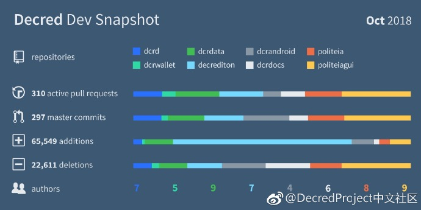

# 解析评级 - [DCR 通过混合共识机制平衡权益分配｜标准共识评级](https://www.aicoin.net.cn/article/54939.html)

很久没看到有意思的DCR评级了。Decred这个项目也算是老项目了，评级不少机构也做过，很多做的也就那样。前两天看到了这篇觉得还是写的可以，决定来个短文评论一下。 

这份评级由[标准共识](https://www.sncrating.com/)(Standard & Consensus) 准备，于11月22日发布。评价为 C+ 级别-一般风险。我看了标准共识网站，目前没有“较低风险”级别的项目。最好的评级结果为 B+，获得这个评级的项目包括大家熟悉的 EOS，ADA，MIOTA。

那其他的币种我不太了解也不讨论了。看看评级说的什么吧。

Overview 概述 
> 获得「C+」评级的主要原因是：Decred 社交媒体热度低；DCR 换手率低，流动性风险高；PoS+PoW 混合共识机制有利于平衡相关利益方的权益；项目开发团队有较好的区块链开发经验；提案及投票系统使得社区拥有较高的项目治理权。

风险点 包括 
> 1. Decred 社交媒体热度低 
> 2. DCR 换手率低，流动性风险高

优势 包括 
> 1. Decred使用PoS+PoW混合共识机制，一定程度平衡了Token持有人，矿工，开发者三方权益 
> 2. 团队技术实力较强，Decred主要开发者曾开发btcsuite
> 3. Politeia提案及投票系统使得社区拥有较高的项目治理权

### 市场及产品分析
评级精确列出Decred的几个特点和持续发展的场景。值得补充的是

1. Decred项目做出了第一个跨链原子交换。Decred在2017年9月已经宣布成功完成了[第一个跨链原子交换](https://blog.decred.org/2017/09/20/On-Chain-Atomic-Swaps/)(这次原子交换是DCR和LTC的互换)。同时Decred也分享了第一个原子交换工具。后来市面上原子交换都是基于这个工具发展开来的。

2. DCR的特有PoS+PoW混合共识机制，使得攻击DCR所需的成本高出很多。Decred支持者也发过文章叙述如果在相同的条件下跟比特币相比，[攻击Decred成本要比攻击比特币要贵20倍](https://medium.com/@guang.dcr/%E7%BF%BB%E8%AF%91-%E4%B8%80%E5%AF%B9%E4%B8%80%E6%AF%94%E8%BE%83-%E6%94%BB%E5%87%BBdecred%E8%A6%81%E6%AF%94%E6%94%BB%E5%87%BB%E6%AF%94%E7%89%B9%E5%B8%81-%E8%A6%81%E8%B4%B520%E5%80%8D-9d108a791e75)。

3. 另外在和其他货币类对比表格里提到支付生态方面官网未列示其应用商家是不正确的。在[官网交易所页面底部](https://www.decred.org/exchanges/)列出了多个“Decred Payment Processors”。整合DCR支付已经非常方便，而且通过Livingroomofsatoshi,DCR可以用于支付很多澳大利亚账单。

### 技术分析

1. 票池通过调整票价控制总选票数量。目标设立在40，960张，选票被选中投出的时间符合泊松概率分布，投票时间为：1-142天；平均投票时间为28天，28天内被选中的概率是50%；最长142天投出去；还有0.5%的概率票会过期。而目前(11月23日)票池数量是41，297张，所以票价为105.41DCR。47.1%的DCR被锁定。

锁定票数及DCR数稳定上涨。表示持币者对项目的信心稳定。

2. 从Github代码方面，评级指出了多个明显Decred项目比其他项目优秀的重要指标，包括更新频繁度，结构模块划分，甚至代码注释清晰。这些都可以突显DCR开发人员能力的重要指标。

DCR Dev Snapshot 显示10月份中Decred代码库的活跃程度。

### 社群基础

1. 用户社区中漏掉了最大最活跃的社区。开发人员，承包商，贡献者和持币者在Slack社区和Matrix社区是最活跃的。在[十月份简报](https://github.com/xaur/decred-news/blob/master/journal/201810.md)中，Slack用户是6千多人。评级方居然漏掉了最大最活跃的社区，有点令人不可思议。

> Community stats:

>* Twitter followers: 41,602 (+1,818)
>* Reddit subscribers: 8,984 (+200)
>* Matrix users: 193 (+6)
>* Slack users: 6,271 (+122)
>* YouTube subscribers: 3,726 (+8)
>* Facebook followers: 3,085 (+25), likes: 2,849 (+23)
>* LinkedIn followers: 412 (+37), Politeia page followers: 13
>* GitHub dcrd stars: 430 (+11), forks: 1,118 (+45)

### 团队分析

1. Decred是一个开源项目，任职信息是Company 0的职位。虽然Company0 是DCR项目很大部分代码贡献者，很多其他开发者也参与其中。在Decred项目里面，并没有CEO CTO 等职位。具体参考[贡献者页面](https://www.decred.org/contributors/)

评级忽略了开源项目这点，把Company0和项目贡献者两方混淆了，同时也忽略了Decred采用的Contractor承包商制度。

### 基金会

1. 基金会是有部分区块奖励（10%）筹集的。目前Company0通过DecredHoldingGroup象征性掌控资金。具体资金的掌控是通过Politeia提案系统慢慢交接到持币者手中。

### 项目履约情况

1. 目前投入使用的不止分析中提到的Politeia提案系统。
2. SPV钱包整合已经完成。Decrediton也已经可以手动激活SPV选项。
3. Decentralized Control of Funds - 去中心化管理资金 和 Decrediton 钱包整合 都已经部分完成。
4. Marketing Growth - Politeia 提案系统月初对区块链最好的两家专业宣传公司的合作提案作出投票。最后[Ditto的提案](https://proposals.decred.org/proposals/27f87171d98b7923a1bd2bee6affed929fa2d2a6e178b5c80a9971a92a5c7f50)以62.32%同意票通过。

### 项目信息披露义务

1. 评级漏掉了Decred项目方最活跃的沟通渠道-Slack/Matrix
2. 团队中大部分成员的履历信息都在[官网](https://www.decred.org/contributors/)上有链接。另外评级方把Decred和大部分ICO项目评级的方式，要求项目成员披露履历信息，个人觉得是不合理的。开源项目的精神就是不管任何人只要有合适的技能都能做出贡献。加上Decred未来有意开发匿名功能，所以对某些隐私信息保密是合理的。
3. 评级提出Decred并未以周报形式更新项目进展和不定时发布进展信息 - 这点是不正确的。项目社区成员以[月报](https://github.com/xaur/decred-news/tree/master/journal)的形式推出进展总结已经超过六个月了。自从提案系统Politeia上线后，社区成员也准备了[Pi简报](https://github.com/RichardRed0x/politeia-digest)每周提供Pi最新消息。社区自主发动的这些更新消息可以看出社区的自发性和参与度。开发人员所有的贡献在Github里是非常透明化的，无需像ICO项目一样整理周报对社区（投资者）汇报。

### 总结 
整体来说这份评级分析的还是很详细。对于遗漏的信息，希望评级方可以尽早修正，确保评级信息无误。

当中我个人比较不能认同的是评级采用跟ICO项目评级一样的方式来评级开源项目。没有进行过ICO的项目需要一些不一样的评级标准，主要是项目并没有筹集资金这一步骤。绝大部分贡献都是出于社区自愿形式 而不像部分拥有充足资金的项目在宣传方面投入。

大部分项目方筹集资金后如何发软文，缴上币费到交易所刷量交易，拉盘，专员整理报告，专业的社区管理 市值管理等等手段都已经不是什么秘密。相比开源项目大部分活动都出于矿工或持币者自愿付出的形式 区别是很大的。采用一样的评级标准对这些项目难免有点不公平。

中文社区 @Guang
欢迎反馈至Github或联系作者

